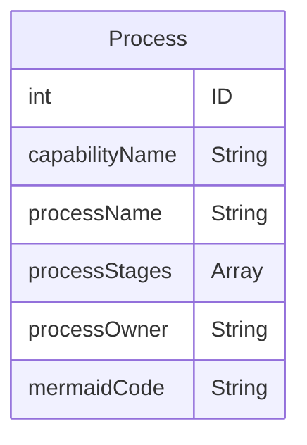

### Map-O:

#### Process and Knowlege mapping tool for all organizations.

#### Models:




### List of routes:
#### Backend routes:


### Route Table
| Endpoint | Method | Description |
| -------- | -------- | -------- |
| /maps | GET | brings user to the homepage where they're able to create new process map or sselect one to view 
| /maps/:id | GET | brings user to a specific process map based on their selection
| /maps | POST | creates a new process map |
| /maps/:id | PUT | updates a specific process map based on the ID |
| /maps/:id | DELETE | deletes a process map based on ID | 


#### List for frontend routes

```
    App --> Header
    App --> Outlet
    Outlet -- "/" --> Index 
    Outlet -- "/:id" --> Show
    Outlet -- "/update/:id" --> updateAction
    Outlet -- "/delete/:id" --> deleteAction
    Outlet -- "/create" --> createAction
```

#### Component Architecture:


#### Webdesign Mockup:

#### Index Page:


#### Create Page


#### Show Page


#### Edit Page


#### Technologies Used:
Backend:
MongoDB
Express
Node JS

Frontend:
React 
Javascript
Mermaid JS